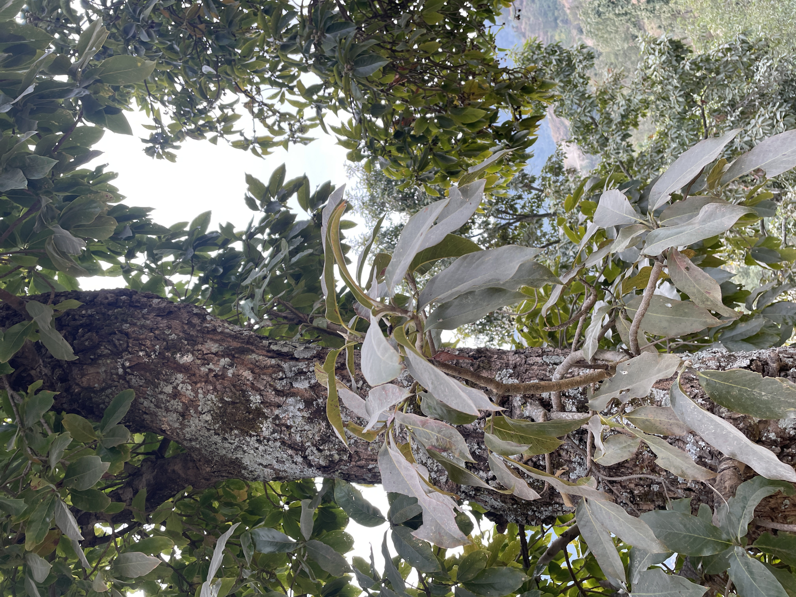
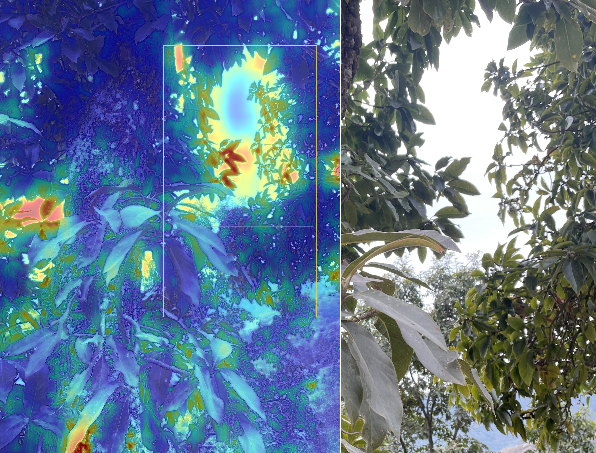
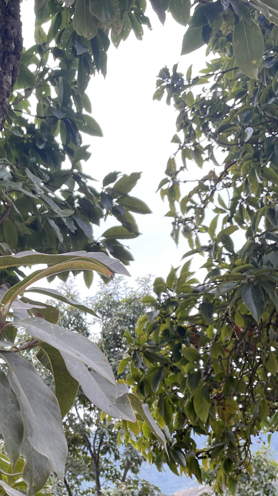
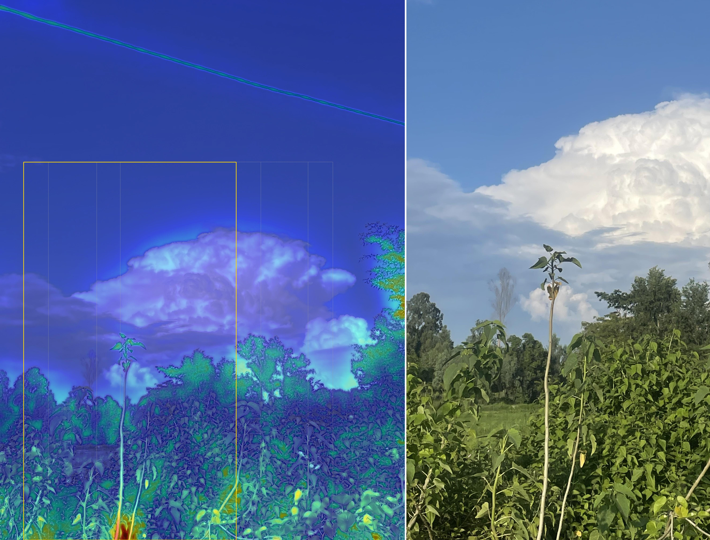
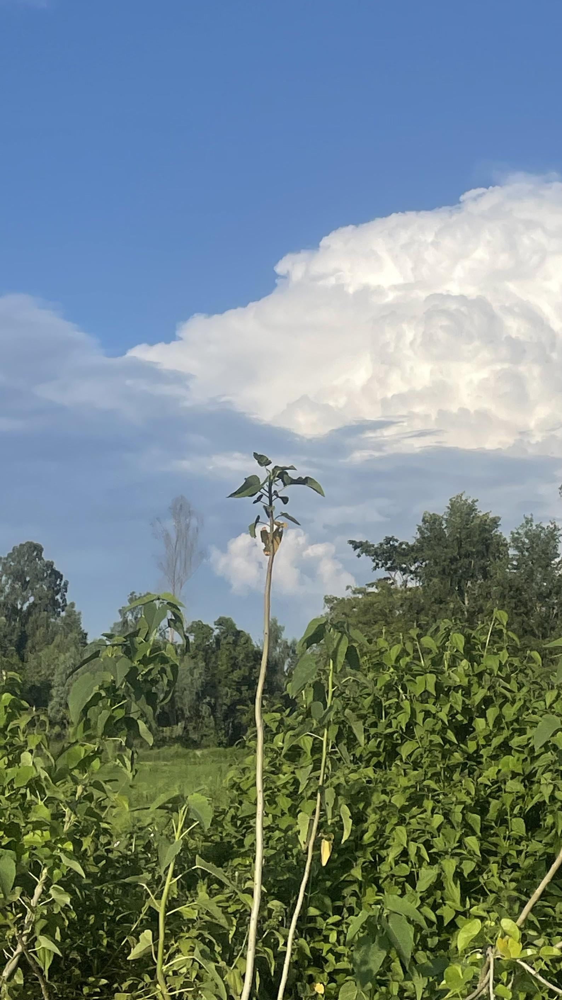

# smartcrop


Automatically find the "best" crop rectangle of a photo — fast, no
training required, no GPU. Tuned for **"would this look good posted on
social media"**, not just "technically contains the subject."

Given an image, this finds the region worth keeping (saliency) and how
aesthetically strong different regions are (sharpness / colorfulness /
saturation / contrast / exposure), searches over candidate crop
rectangles, and returns the best one **as plain (x0, y0, x1, y1) pixel
coordinates** — the image itself is optional.

It's a heuristic pipeline (no model training required to use it) that
also ships an optional trained aesthetic-quality model (NIMA) for
going beyond heuristics — see "Where this falls short" and "Optional:
learned aesthetic scoring (NIMA)" below.

<table>
<tr>
<td align="center"><b>Original</b><br></td>
<td align="center"><b>Saliency + chosen box</b><br></td>
<td align="center"><b>Resulting crop</b><br></td>
</tr>
<tr>
<td align="center"><b>Original</b><br></td>
<td align="center"><b>Saliency + chosen box</b><br></td>
<td align="center"><b>Resulting crop</b><br></td>
</tr>
</table>

## Contents

- [Speed](#speed)
- [The actual goal](#the-actual-goal-looks-good-on-social-media-not-just-technically-correct)
- [How it works](#how-it-works)
- [Install](#install)
- [Quick start](#quick-start)
- [Example](#example)
- [Where this falls short](#where-this-falls-short)
- [Optional: deep saliency backend (U²-Net)](#optional-deep-saliency-backend-u²-net)
- [Optional: learned aesthetic scoring (NIMA)](#optional-learned-aesthetic-scoring-nima)
- [Project layout](#project-layout)
- [Tuning](#tuning)
- [License](#license)

## Speed

The whole pipeline runs on a downscaled working copy of the image
(default: longest side capped at 480px) and scores every candidate crop
in one vectorized numpy pass (integral images / summed-area tables) —
no per-candidate Python loop. Final coordinates are rescaled back to the
original image's resolution.

| stage                                               | time (4032×3024 photo) |
| --------------------------------------------------- | ---------------------- |
| JPEG decode (unavoidable, any approach)             | ~75ms                  |
| saliency + aesthetic maps + scoring ~300 candidates | ~100ms                 |
| **total, `crop()`**                                 | **~170-250ms**         |

If you already have the image decoded in memory (e.g. a web server that
already loaded it for something else), it's the ~100ms figure, not the
~250ms one. An earlier, non-vectorized version of the scorer took **~21
seconds** on the same photo — the fix was removing a per-candidate
`np.mgrid` centroid computation and downscaling the analysis image; see
`smartcrop/fast_score.py`'s docstring for details, and
`tests/test_smartcrop.py::test_large_image_is_fast` for the regression
test that guards against it coming back.

Tune the speed/precision tradeoff with `analysis_size` (default 480):

```python
SmartCropper(analysis_size=320)   # faster, coarser box placement
SmartCropper(analysis_size=800)   # slower, finer box placement
```

## The actual goal: looks good on social media, not just "technically correct"

The scoring is tuned for **"would this look good posted"**, not merely
"contains the subject." Concretely, that means:

- **Social platform presets** — `crop_for_social(photo, platform="instagram_story")`
  instead of remembering aspect ratios. See `smartcrop/social.py` for the
  full list (Instagram post/story/reel, TikTok, Twitter/X, YouTube
  Shorts/thumbnail, Pinterest, LinkedIn, etc).
- **Aesthetic-quality signals** (colorfulness, saturation/"pop", contrast,
  sharpness) are part of the score, not just subject coverage — see
  `smartcrop/aesthetics.py`.
- **A real regression test guards a real mistake I made getting here**:
  an earlier tuning pass weighted colorfulness/saturation too heavily,
  and the scorer picked a plain, brightly-saturated pink blanket over a
  much more striking (but less saturated) moody window shot — because
  raw "vibrant" isn't the same as "good," and nothing was stopping the
  aesthetic terms from overriding subject choice entirely. Fixed by
  making aesthetic terms **tie-breakers among subject-relevant
  candidates**, not independent drivers that can outvote the subject.
  `tests/test_smartcrop.py::test_aesthetic_terms_dont_override_subject_choice`
  locks this in using the actual photo that caught it.
- **Optional: a real trained aesthetic model (NIMA)**, for going beyond
  hand-built heuristics entirely — see "Optional: learned aesthetic
  scoring (NIMA)" below. Heuristics are proxies for "looks good";
  NIMA is a model trained directly on ~250K human aesthetic ratings.

If you tried the previous version on a scenic/landscape photo and got
back something barely different from the original — that was a real bug,
not a hard case like the mesh photo. The `coverage` term was a raw sum of
saliency inside the box, which is mathematically almost guaranteed to
increase with box size (saliency values are never negative, so a bigger
box can only add mass, never lose it). With `coverage` weighted at 1.0
and the old size penalty only kicking in above 92% of the frame, the
scorer was structurally biased toward "just keep everything."

Fixed by replacing that with an explicit **recall-vs-area tradeoff**:
the score now rewards retained saliency (`coverage`, i.e. recall) minus
a direct **cost per unit of frame area used** (`area_cost`). This is a
real marginal tradeoff — a candidate only wins by including more area if
the saliency it picks up is worth more than the area it costs — instead
of a threshold that only discourages the most extreme near-full-frame
cases. On the landscape photo used to catch this (tree + gap in clouds,
mostly empty foreground riverbed), the old version kept 81% of the
frame; the new version tightens to a ~46% crop that trims the dead
foreground and excess sky. See `smartcrop/fast_score.py` for the exact
formula, and its top-of-function comment for the reasoning.

## How it works

```
image
  │
  ▼ (downscaled to analysis_size)
saliency map          ──►  "what's interesting" (OpenCV spectral-residual
  │                         + fine-grained saliency, blended; or optionally
  │                         a plugged-in deep model, see below)
  │
aesthetic maps         ──►  sharpness / colorfulness / saturation /
  │                         luminance, per pixel (used both per-candidate
  │                         and for a whole-image aesthetic score)
  ▼
candidate crop boxes  ──►  grid of boxes at multiple aspect ratios,
  │                        scales, and offsets (generated in the
  │                        downscaled coordinate space)
  ▼
vectorized scoring (integral images, all candidates at once)  ──►
  │             + coverage:     retained saliency mass (recall)
  │             − area_cost:    cost per unit of frame area used -- this,
  │                              not a size threshold, is what actually
  │                              creates pressure to crop tightly
  │             + thirds:       is the salient centroid near a rule-of-
  │                              thirds intersection
  │             − boundary:     does the box edge slice through salient
  │                              content
  │             − tiny_penalty: floor against degenerate near-empty crops
  │             + sharpness:    prefer crops over in-focus regions
  │             + colorfulness: prefer crops with color interest
  │             + saturation:   prefer crops with vibrance/"pop"
  │             + contrast:     prefer crops that aren't flat/hazy
  │             + exposure:     prefer crops that aren't blown out/crushed
  ▼
best-scoring box  ──►  rescaled to original resolution  ──►  (x0,y0,x1,y1)
```

## Install

```bash
pip install -r requirements.txt
```

No model download needed for the default backend — OpenCV's built-in
saliency module ships with `opencv-contrib-python-headless`.

## Quick start

**Just want the rectangle for a specific platform?**

```python
from smartcrop import crop_for_social

x0, y0, x1, y1 = crop_for_social("photo.jpg", platform="instagram_story")
```

**Just want the rectangle?** This is the fast path — no image encoding/
decoding of the output, just coordinates:

```python
from smartcrop import find_best_crop

x0, y0, x1, y1 = find_best_crop("photo.jpg", aspect_ratio="4:5")
# (0, 252, 3024, 4032)
```

**Want the image / debug view / aesthetic breakdown too?**

```python
from smartcrop import SmartCropper

cropper = SmartCropper()
result = cropper.crop("photo.jpg", aspect_ratio="4:5")

print(result.box)              # (x0, y0, x1, y1) in source pixels
print(result.score)            # the winning candidate's composition score
print(result.elapsed_seconds)  # wall-clock time for the crop() call
print(result.aesthetic)        # {'score': 78.6, 'sharpness': 100.0,
                                #  'colorfulness': 18.0, 'contrast': 97.3,
                                #  'exposure': 99.0}

result.image.save("photo_cropped.jpg")           # PIL Image, the chosen crop
result.debug_visualization().save("debug.jpg")   # heatmap + boxes + crop
```

**Just want to know if a photo is aesthetically decent, no cropping?**

```python
import cv2
from smartcrop import image_aesthetic_score

image_aesthetic_score(cv2.imread("photo.jpg"))
# {'score': 78.6, 'sharpness': 100.0, 'colorfulness': 18.0,
#  'contrast': 97.3, 'exposure': 99.0}
```

Useful for ranking/filtering a batch of photos (blurry, flat, over/under
exposed shots score low) independent of any crop.

Or from the command line:

```bash
# Just the rectangle + scores, as JSON, nothing written to disk:
python -m smartcrop.cli photo.jpg --aspect 4:5 --coords-only

# By platform name instead of an aspect ratio:
python -m smartcrop.cli photo.jpg --platform instagram_story --coords-only

# Re-rank with the bundled learned aesthetic model (NIMA), adds ~200-400ms:
python -m smartcrop.cli photo.jpg --aspect 4:5 --use-nima --coords-only

# Full run: crop file + debug visualization:
python -m smartcrop.cli photo.jpg --out cropped.jpg --aspect 4:5 --debug debug.jpg
```

Full CLI reference:

| Flag                 | Default                 | What it does                                                                                             |
| -------------------- | ----------------------- | -------------------------------------------------------------------------------------------------------- |
| `input` (positional) | —                       | Path to the source image                                                                                 |
| `--out`, `-o`        | `<input>_cropped.<ext>` | Where to save the cropped image                                                                          |
| `--aspect`, `-a`     | multi-ratio search      | Target ratio, e.g. `4:5`, `16:9`, `1:1`                                                                  |
| `--platform`, `-p`   | —                       | Named preset instead of `--aspect`, e.g. `instagram_story` — see `smartcrop/social.py` for the full list |
| `--backend`          | `auto`                  | Saliency backend: `auto`, `spectral`, `fine`, `u2net`                                                    |
| `--analysis-size`    | `480`                   | Working resolution cap (px); lower = faster                                                              |
| `--use-nima`         | off                     | Re-rank top candidates with the bundled NIMA model                                                       |
| `--nima-top-k`       | `8`                     | How many candidates to re-rank when `--use-nima` is set                                                  |
| `--coords-only`      | off                     | Print JSON (box, score, aesthetic, nima_score if used) and exit — no image files written                 |
| `--debug`            | —                       | Also save the heatmap+boxes+crop debug visualization to this path                                        |

`--coords-only` is the one to reach for if you're calling this from a
script/pipeline — it skips writing any image and just prints:

```json
{
  "box": [1134, 269, 2646, 2159],
  "score": 0.9123,
  "elapsed_seconds": 0.27,
  "aesthetic": {
    "score": 78.6,
    "sharpness": 100.0,
    "colorfulness": 18.0,
    "contrast": 97.3,
    "exposure": 99.0
  },
  "nima_score": 5.328
}
```

(`nima_score` only appears if `--use-nima` was passed.) Note: each CLI
invocation pays a one-time ONNX session startup cost for `--use-nima`
(~1-1.5s on first call in a fresh process) — that cost disappears if
you're calling `SmartCropper` from long-running Python code instead of
shelling out per image, since the model session is cached across calls.

If you omit `--aspect` / `aspect_ratio`, the cropper searches over several
common aspect ratios (1:1, 4:5, 3:4, 16:9, 9:16, plus the source image's
own ratio) and picks the best one overall.

## Example

`examples/run_example.py` runs the pipeline end-to-end on an image and
saves both the crop and a debug visualization:

```bash
python examples/run_example.py examples/IMG_1049.JPG
```

`examples/IMG_1049.JPG` is the included test photo (tree branches/leaves
against a bright sky — lots of texture, no single obvious subject),
generated via
`python -m smartcrop.cli examples/IMG_1049.JPG --out outputs/cropped.jpg --debug outputs/debug.jpg`:


## Where this falls short

Heuristic saliency is not a subject-detection model — it's finding
regions that are locally different from their surroundings (contrast,
color, texture), not "the object a human would call the subject." In
practice:

- **Works well**: one clear subject against a duller/busier background —
  a bright window in a dark room, a product on a table, a person against
  a wall.
- **Struggles**: photos where the "interesting" content is a repeating
  texture or pattern with no single standout region (a close-up of a
  mesh screen or grille is a good example — the map lights up scattered
  texture noise rather than one coherent subject), multiple
  similarly-salient regions, or compositions where "best crop" is really
  an aesthetic/artistic judgment rather than an object-presence one.
- Run `examples/run_example.py` on a tight close-up of a repeating
  texture (a mesh screen, grille, or — as in the tree-canopy example
  above — dense foliage) and check the saved `*_debug.jpg` to see the
  saliency map struggle: it lights up scattered texture noise instead of
  one coherent subject.

For those harder cases, the next step up is a model trained on
human-annotated cropping preferences (e.g. GAICD or FCDB datasets, a
grid-anchor regression architecture) — a heavier but still modest
project (single consumer GPU, hours of training). This repo's structure
(`saliency.py` → `candidates.py` → `scorer.py`) is meant to make that
swap straightforward later: you'd mostly be replacing `scorer.py`'s
hand-written weights with a learned scoring model, and could reuse
`candidates.py` as-is.

## Optional: deep saliency backend (U²-Net)

The scorer works with _any_ saliency map, so you can drop in a proper
salient-object-detection model instead of the OpenCV heuristics:

1. Get a `u2netp.onnx` file (the small/"portable" U²-Net variant is
   plenty — search "u2netp onnx", e.g. exported from the official
   [U-2-Net repo](https://github.com/xuebinqin/U-2-Net)).
2. Place it at `smartcrop/models/u2netp.onnx`.
3. `pip install onnxruntime`
4. `SmartCropper(saliency_backend="auto")` (or `"u2net"` explicitly) will
   pick it up automatically.

This typically gives noticeably cleaner "this is the subject" maps than
the spectral-residual default, at the cost of a ~5-15MB model file and a
slightly heavier inference step (still CPU-friendly).

## Optional: learned aesthetic scoring (NIMA)

**This is already included and working** — `smartcrop/models/nima_mobilenet.onnx`
ships with this repo, converted from
[titu1994/neural-image-assessment](https://github.com/titu1994/neural-image-assessment)'s
MobileNet weights (trained on the AVA dataset — ~255,000 photos, each
rated 1-10 by real people for aesthetic quality). Verified against the
original Keras model's output before conversion (same scores to 3+
decimal places). Everything else in `aesthetics.py` is hand-built
heuristics (sharpness, colorfulness, saturation, contrast, exposure) —
fast proxies for "looks good." NIMA is a model trained directly on human
aesthetic judgments, so it's a genuine "how good does this look" score
rather than a formula.

```python
from smartcrop import SmartCropper

cropper = SmartCropper(use_nima=True, nima_top_k=8)
result = cropper.crop("photo.jpg", aspect_ratio="4:5")
print(result.nima_score)  # ~1-10, the winning crop's learned aesthetic rating
```

This re-ranks the top `nima_top_k` heuristic candidates by NIMA score
rather than trusting the heuristic #1 pick outright, so it stays fast —
one small-model inference call per shortlisted candidate (~300ms total
for the default top_k=8 on CPU), not per candidate of the ~300 originally
scored. `pip install onnxruntime` is required (not in the base
requirements, to keep the default install light); if it's missing,
`use_nima=True` silently falls back to heuristic-only.

**If you swap in a different NIMA export**, check its expected
preprocessing carefully — this model expects `(pixel/127.5) - 1.0`
scaling and NHWC layout (`keras.applications.mobilenet.preprocess_input`
convention), not the more common `/255.0` + NCHW you'd expect from a
PyTorch export. Get this wrong and the model still runs, it just scores
everything ~equally (a classic silent-failure mode for swapped
preprocessing) — see the comment in `aesthetics.py::nima_score`.

## Project layout

```
smartcrop/
  __init__.py
  saliency.py     saliency map computation (spectral / fine-grained / u2net)
  aesthetics.py   sharpness/colorfulness/saturation/contrast/exposure maps,
                  whole-image aesthetic score, optional NIMA learned-
                  aesthetic-score hook
  social.py       social platform aspect-ratio presets (SOCIAL_PRESETS,
                  resolve_aspect_ratio) -- Instagram/TikTok/Twitter/etc
  candidates.py   candidate crop box generation
  fast_score.py   vectorized, integral-image scoring of ALL candidates at
                  once (the thing that makes this fast)
  scorer.py       original per-candidate scorer, kept for reference /
                  backward compatibility; fast_score.py is what's used
                  by default now
  cropper.py      SmartCropper high-level API, CropResult, find_best_crop(),
                  crop_for_social()
  cli.py          command-line entry point (--coords-only, --platform)
  models/         (empty by default; optional u2netp.onnx / nima_mobilenet.onnx go here)
examples/
  run_example.py
  IMG_1049.JPG      included test image (tree canopy against bright sky)
outputs/
  cropped.jpg       example crop, checked in so you can see the result
                     without running anything
  debug.jpg         matching debug visualization (heatmap + box + crop)
tests/
  test_smartcrop.py   includes regression tests for both bugs found while
                       building this (barely-crops-anything, and aesthetic
                       terms overriding subject choice)
requirements.txt
```

## Tuning

`SmartCropper(weights={...})` rebalances the ten scoring terms:
`coverage`, `area_cost`, `thirds`, `boundary_penalty`, `tiny_penalty`
(composition), and `sharpness`, `colorfulness`, `saturation`, `contrast`,
`exposure` (aesthetic quality). Defaults live in `fast_score.py`.

`area_cost` is the main lever for "how aggressively should this crop":

```python
SmartCropper(weights={"area_cost": 0.5})   # looser, keeps more of the frame
SmartCropper(weights={"area_cost": 1.4})   # tighter, more aggressive crop
```

Example — product photography, where you want the product centered and
fully visible rather than rule-of-thirds framed, and don't care about
colorfulness (product might be white-on-white):

```python
cropper = SmartCropper(weights={"coverage": 1.5, "thirds": 0.1, "colorfulness": 0.0, "saturation": 0.0})
```

Example — favor sharp, well-exposed regions much more strongly (useful
if the saliency map is noisy on a given photo, e.g. textured/patterned
images):

```python
cropper = SmartCropper(weights={"sharpness": 0.8, "exposure": 0.5})
```

## License

MIT — see [LICENSE](LICENSE). The bundled `smartcrop/models/nima_mobilenet.onnx`
is converted from weights published by
[titu1994/neural-image-assessment](https://github.com/titu1994/neural-image-assessment)
(also MIT); the NIMA architecture itself is from Talebi & Milanfar,
["NIMA: Neural Image Assessment"](https://arxiv.org/abs/1709.05424) (2018),
trained on the AVA dataset. If you swap in a U²-Net or other third-party
model file (see above), check that model's own license terms separately —
they aren't covered by this repo's license.
